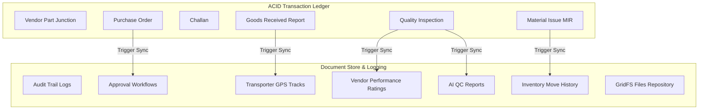

# Hybrid SCM Database Architecture

This portal combines a relational ledger (MySQL) with a flexible document store (MongoDB) to handle both strict ACID transactions and fast, scalable unstructured logging.

---

## 🛠️ Hybrid Database Design

---

## 🔄 Dual Database Roles

### 1. MySQL (Relational Core - 3NF)
* **Master Records:** `Part`, `Vendor`, `Transporter`, `Part_Category`.
* **ACID Transactions:** Financial agreements (PO), physical receipts (GRR), inspection records, and internal issues (MIR) where double-entry balances must prevent stock duplication.
* **ORM:** Sequelize manages relation joins and transactional commits/rollbacks.

### 2. MongoDB (Document & Unstructured Core)
* **Approval Workflows:** Dynamic authorization chains (comments, status histories) which change per document type.
* **Audit Trails:** JSON comparison before/after states of changed records.
* **Rich Reports:** Photo uploads, signature indices, and automated AI analysis details.
* **IoT Sensor Data:** High-velocity temperature and moisture tracking logs in warehouses.
* **GridFS File Storage:** Splits PDF sheets, receipt files, and invoices into manageable binary chunks.

---

## 🔐 Authorization & Security (RBAC)

API security is implemented via JSON Web Tokens (JWT) combined with active role authorization gates.

| Role | Access Limits |
|------|---------------|
| **Admin** | Unrestricted access (UAC panel, global search, audit logs, configuration). |
| **Purchase Manager** | Sourcing master controls, PO raising, price configurations, and spend analytics. |
| **Store Manager** | Goods receipt (GRR), MIR issuance, stock balances, and climate logs. |
| **Inspector** | Quality inspection inputs, report uploads, and quality audits. |
| **Vendor** | Dispatch challan updates, PO receipts. |
| **Viewer** | Read-only catalogs, status reports. |
